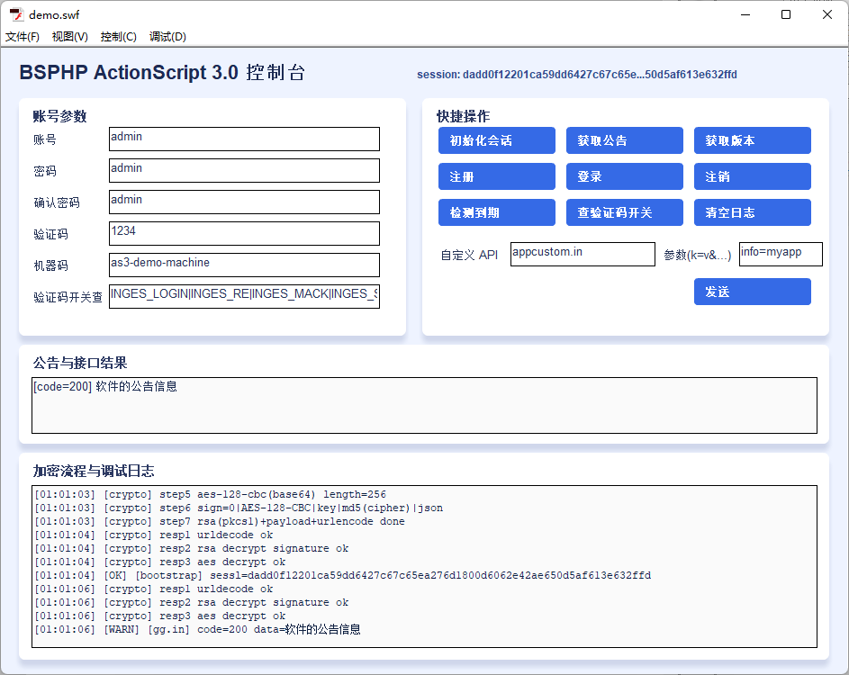
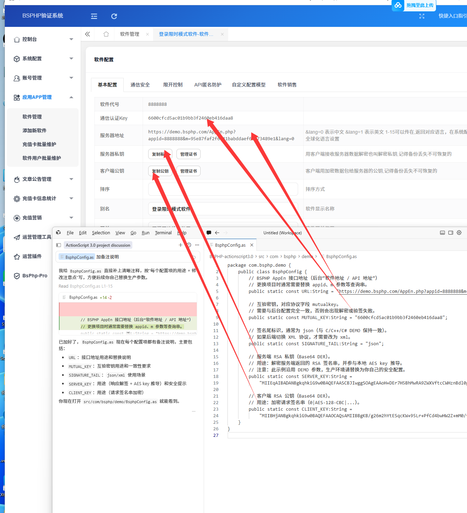

# BSPHP ActionScript 3.0 Demo

这个项目是 BSPHP 登录流程的 ActionScript 3.0（Flash）演示版，已对齐 C/C++/C# DEMO 的真实协议流程。

## 功能概览

- 初始化会话：`internet.in` + `BSphpSeSsL.in`
- 公告：`gg.in`
- 注册：`registration.lg`
- 登录：`login.lg`
- 版本：`v.in`
- 到期检测：`vipdate.lg`
- 注销：`cancellation.lg`
- 验证码开关查询：`getsetimag.in`
- 自定义 API 调用（手动输入接口和参数）

## 协议配置说明

### 1) 接口与密钥配置

配置文件：`src/com/bsphp/demo/BsphpConfig.as`

- `URL`：BSPHP AppEn 接口地址
- `MUTUAL_KEY`：互验密钥（`mutualkey` 字段）
- `SERVER_KEY`：服务端 RSA 私钥（Base64 DER）
- `CLIENT_KEY`：客户端 RSA 公钥（Base64 DER）
- `SIGNATURE_TAIL`：签名尾，默认 `json`

> 如果你换成自己的 BSPHP 后台，只需要把这几个值改为你的后台配置。

### 2) 运行模式配置

配置文件：`src/com/bsphp/demo/BsphpClient.as`

- `demoMode = false`：真实网络 + 真实加密协议（默认）
- `demoMode = true`：本地模拟返回（不请求后端）

### 3) 编译路径配置

配置文件：`asconfig.json`

- 已包含 `src`
- 已包含 `vendor/as3-crypto/src`（AES/RSA/MD5 所需库）

## 加密流程说明（已实现）

实现文件：`src/com/bsphp/demo/CryptoFlow.as`

请求流程：

1. 生成 `appsafecode = md5(yyyy-MM-dd HH:mm:ss)`
2. 组参数：`api/BSphpSeSsL/date/md5/mutualkey/appsafecode + 业务参数`
3. `md5` 字段按协议填充
4. `aesKey = md5(serverKey + appsafecode).substr(0,16)`
5. AES-128-CBC 加密明文（Key=IV，PKCS padding）得到 Base64 密文
6. 签名串：`0|AES-128-CBC|aesKey|md5(cipher)|json`
7. 用客户端公钥 RSA PKCS#1 加密签名串
8. 发送：`parameter=urlencode(aesCipherB64 + "|" + rsaB64)`

响应流程：

1. URL Decode 响应
2. 拆分 `OK|aes|rsa` 或 `aes|rsa`
3. 用服务端私钥 RSA 解签名串，取响应 AES key
4. AES 解密响应密文
5. 解析 JSON/XML，提取 `code/data/SeSsL/appsafecode`

## Flash CS6 配置步骤

1. 新建 ActionScript 3.0 文档
2. 保存 `fla` 到项目根目录
3. 在舞台空白处打开属性面板，设置文档类为 `Main`
4. 打开 `文件 -> ActionScript 设置`，添加 Source Path：
   - `.../BSPHP-actionscript3.0/src`
   - `.../BSPHP-actionscript3.0/vendor/as3-crypto/src`
5. `Ctrl+Enter` 测试影片

## 界面截图

下面两张图是项目当前界面示例（Markdown 已按相对路径引用，可直接显示）：





## 页面输入项配置说明

主界面可编辑字段：

- 账号、密码、确认密码、验证码
- 机器码（用于登录/注册 `key` 等字段）
- 验证码开关查询 type（如 `INGES_LOGIN|INGES_RE|INGES_MACK|INGES_SAY`）
- 自定义 API 名和参数串（`k1=v1&k2=v2`）

## 常见状态码（演示中常见）

- `1001`：通用成功
- `1009`：注册成功
- `1011`：登录成功
- `9908`：可视为登录有效（按 DEMO 逻辑）

## Git：确认“已全部纳入版本库”

若你感觉“提交不全”，先在仓库根目录执行：

```powershell
git add -A
git status
```

再运行自检脚本（会扫描磁盘上除 `.git` 外的每个文件是否已被 `git` 跟踪）：

```powershell
powershell -ExecutionPolicy Bypass -File .\scripts\verify-all-tracked.ps1
```

输出 `OK` 即表示：**工作区文件与索引一致，没有漏跟踪的文件**。

说明：`vendor/as3-crypto` 目录内**不应再保留**嵌套的 `.git` 仓库；本仓库已在 `.gitignore` 中忽略 `vendor/as3-crypto/.git/`，并把该库以**普通源码文件**方式完整纳入，避免克隆后只有空壳子目录。

### 克隆后没有 `vendor` 目录怎么办

本仓库**应当**包含完整的 `vendor/as3-crypto`（约三百余个文件）。若你本地看不到 `vendor`：

1. 确认克隆的是**本仓库最新提交**（含 `vendor` 的那次），并已 `git pull`。
2. 若目录被误删，可在仓库根目录执行恢复脚本（会重新从 GitHub 拉取 as3-crypto 到 `vendor/as3-crypto`，并删除嵌套 `.git` 以与工程一致）：

```powershell
powershell -ExecutionPolicy Bypass -File .\scripts\restore-vendor.ps1
```

3. 仍没有时，在本机执行 `git ls-files vendor | measure`，若行数为 0，说明当前检出的不是完整历史，请向提供仓库的一方确认是否已推送包含 `vendor` 的提交。

## 常见问题

- 报 `security_error`
  - Flash 跨域限制，服务端需提供允许策略（`crossdomain.xml`）
- 报 `crypto_error` / `decrypt_error`
  - 检查 `URL/MUTUAL_KEY/SERVER_KEY/CLIENT_KEY/SIGNATURE_TAIL`
- 文档类找不到 `Main`
  - 未设置文档类，或 `src` 路径未加入 ActionScript 源路径
